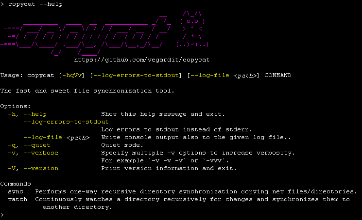
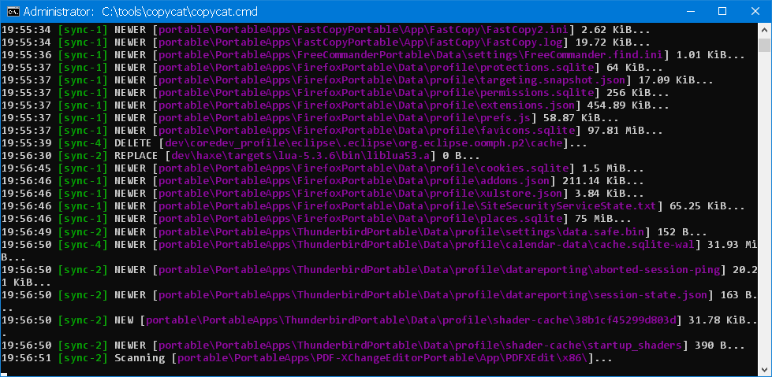

# copycat - the fast and sweet file syncing tool

[](https://github.com/vegardit/copycat/actions?query=workflow%3A%22Build%22)
[](https://github.com/vegardit/copycat/releases/tag/snapshot)
[](LICENSE.txt)
[](CODE_OF_CONDUCT.md)

1. [What is it?](#what-is-it)
1. [Installation](#installation)
1. [Quick Start](#quick-start)
1. [Usage](#usage)
   1. [`sync` command](#sync)
   1. [`watch` command](#watch)
   1. [Filters: including/excluding files](#filters)
1. [Contributing](#contributing)
1. [License](#license)


## <a name="what-is-it"></a>What is it?

Copycat is a cross platform file synchronization tool for local file systems similar to [robocopy](https://docs.microsoft.com/en-us/windows-server/administration/windows-commands/robocopy) for Windows.

It's written in Java but compiled to native binaries for Windows/Linux/MacOS using [GraalVM](https://graalvm.org).





Advantages over robocopy:
- exclude files/folders using relative paths and glob patterns
- cross-platform support
- ANSI-colored, concise console output
- Desktop notifications and tray icon on major sync events
- YAML config for defaults and multiple tasks
- Date/time filters (`--since`, `--until`) with natural language support


## <a name="installation"></a>Installation

For Windows/Linux/macOS, self-contained single-file binaries can be downloaded at https://github.com/vegardit/copycat/releases

No installation is required.

- Windows: download the `.exe` and either run it directly or place it somewhere on your `PATH`.
- Linux/macOS: download the binary, `chmod +x copycat`, then run it (optionally move to a directory on your `PATH`, e.g. `/usr/local/bin`).


## <a name="quick-start"></a>Quick Start

- One-time sync (with deletion):
  - Windows: `copycat sync C:\src X:\dst --delete`
  - Linux/macOS: `copycat sync /src /mnt/dst --delete`
- Continuous sync (watch for changes): `copycat watch <SOURCE> <TARGET>`
- Increase verbosity with `-v`, `-vv`, `-vvv`, or use `-q` for quiet.


## <a name="usage"></a>Usage

Copycat understands two commands:
- `sync` is used to synchronize files from one directory to another
- `watch` is used to continuously watch a directory for changes and instantly syncs the changes to a given target


### <a name="sync"></a>`sync` command

```
$ copycat sync --help

Usage: copycat sync [-hqVv] [--copy-acl] [--delete] [--delete-excluded] [--dry-run] [--exclude-hidden-files]
                    [--exclude-hidden-system-files] [--exclude-older-files] [--exclude-system-files] [--ignore-errors]
                    [--ignore-symlink-errors] [--log-errors-to-stdout] [--config <path>] [--log-file <path>]
                    [--max-depth <n>] [--threads <count>] [--since <when>] [--until <when>] [--filter in|ex:<pattern>]...
                    [--no-log <op>[,<op>...]]... [SOURCE] [TARGET]

Performs one-way recursive directory synchronization copying new files/directories.

Positional parameters:
      [SOURCE]            Directory to copy from files.
      [TARGET]            Directory to copy files to.

Options:
      --config <path>     Path to a YAML config file.
      --copy-acl          Copy file permissions (ACL) for newly copied files.
      --delete            Delete extraneous files/directories from target.
      --delete-excluded   Delete excluded files/directories from target.
      --dry-run           Don't perform actual synchronization.
      --exclude-hidden-files
                          Don't synchronize hidden files.
      --exclude-hidden-system-files
                          Don't synchronize hidden system files.
      --exclude-older-files
                          Don't override newer files in target with older files in source.
      --exclude-system-files
                          Don't synchronize system files.
      --filter in|ex:<pattern>
                          Glob pattern for files/directories to be excluded from or included in sync.
  -h, --help              Show this help message and exit.
      --ignore-errors     Continue sync when errors occur.
      --ignore-symlink-errors
                          Continue if creation of symlinks on target fails.
      --log-errors-to-stdout
                          Log errors to stdout instead of stderr.
      --log-file <path>   Write console output also to the given log file.
      --max-depth <n>     Maximum directory traversal depth from the source root.
                          0=only top-level files (no subdirs), 1=include immediate subdirectories, etc.
                          Default: unlimited.
      --no-log <op>[,<op>...]
                          Don't log the given sync operation. Valid values: CREATE, MODIFY, DELETE, SCAN
  -q, --quiet             Quiet mode.
      --since <when>      Sync only items modified after this date/time. Accepts ISO-8601 dates (2024-12-25),
                          relative expressions (3 days ago), or keywords (yesterday, today, tomorrow).
      --threads <count>   Number of concurrent threads. Default: 2
      --until <when>      Sync only items modified before this date/time. Same format as --since.
  -v, --verbose           Specify multiple -v options to increase verbosity.
                          For example `-v -v -v` or `-vvv`.
```

Examples:
```batch
:: Basic sync with deletion
copycat sync C:\myprojects X:\myprojects --delete --threads 4

:: Sync only files modified in the last 3 days
copycat sync C:\mydata X:\backup --since "3 days ago"

:: Sync files modified between specific dates
copycat sync C:\docs X:\archive --since 2024-01-01 --until 2024-12-31

:: Sync files modified since yesterday at 2 PM
copycat sync C:\work X:\backup --since "yesterday 14:00"
```

Default values and/or multiple sync tasks can be configured using a YAML config file:
```yaml
# default values for sync tasks
defaults:
  copy-acl: false
  delete: true
  delete-excluded: true
  dry-run: false
  exclude-older-files: false
  exclude-hidden-files: false
  exclude-system-files: true
  exclude-hidden-system-files: false
  filters:
    - ex:**/node_modules
    - in:logs/latest.log # keep latest log file
    - ex:logs/*.log # exclude all other log files
  ignore-errors: false
  ignore-symlink-errors: false
  threads: 2
  # Optional: limit directory traversal depth (0=no subdirs)
  # max-depth: 0
  # Optional: sync only recent files
  # since: "7 days ago"  # or "2024-01-01" or "yesterday"
  # until: "today"       # or "2024-12-31" or "tomorrow"

# one or more sync tasks
sync:
- source: C:\mydata
  target: \\myserver\mydata

- source: D:\myotherdata
  target: \\myserver\myotherdata
  # Optional: sync only files modified in the last week
  since: "7 days ago"

- source: E:\archives
  target: \\backup\archives
  # Optional: sync files from a specific date range
  since: 2024-01-01
  until: 2024-12-31
```


### <a name="watch"></a>`watch` command

```
$ copycat watch --help

Usage: copycat watch [-hqVv] [--copy-acl] [--delete-excluded] [--exclude-hidden-files] [--exclude-hidden-system-files]
                     [--exclude-system-files] [--log-errors-to-stdout] [--config <path>] [--log-file <path>]
                     [--max-depth <n>] [--filter in|ex:<pattern>]... [--no-log <op>[,<op>...]]... [SOURCE] [TARGET]

Continuously watches a directory recursively for changes and synchronizes them to another directory.

Positional parameters:
      [SOURCE]            Directory to copy from files.
      [TARGET]            Directory to copy files to.

Options:
      --config <path>     Path to a YAML config file.
      --copy-acl          Copy file permissions (ACL) for newly copied files.
      --delete-excluded   Delete excluded files/directories from target.
      --exclude-hidden-files
                          Don't synchronize hidden files.
      --exclude-hidden-system-files
                          Don't synchronize hidden system files.
      --exclude-system-files
                          Don't synchronize system files.
      --filter in|ex:<pattern>
                          Glob pattern for files/directories to be excluded from or included in sync.
  -h, --help              Show this help message and exit.
      --log-errors-to-stdout
                          Log errors to stdout instead of stderr.
      --log-file <path>   Write console output also to the given log file.
      --max-depth <n>     Maximum directory traversal depth from the source root.
                          0=only top-level files (no subdirs), 1=include immediate subdirectories, etc.
                          Default: unlimited.
      --no-log <op>[,<op>...]
                          Don't log the given filesystem operation. Valid values: CREATE, MODIFY, DELETE
  -q, --quiet             Quiet mode.
  -v, --verbose           Specify multiple -v options to increase verbosity.
                          For example `-v -v -v` or `-vvv`.
```

Example:
```batch
$ copycat watch C:\myprojects X:\myprojects
```


Default values and/or multiple sync tasks can be configured using a YAML config file:
```yaml
# default values for sync tasks
defaults:
  copy-acl: false
  delete-excluded: true
  exclude-hidden-files: false
  exclude-system-files: true
  exclude-hidden-system-files: false
  # Optional: limit directory traversal depth for watching (0=no subdirs)
  # max-depth: 0
  filters:
    - ex:**/node_modules
    - in:logs/latest.log # keep latest log file
    - ex:logs/*.log # exclude all other log files

# one or more sync tasks
sync:
- source: C:\mydata
  target: \\myserver\mydata

- source: D:\myotherdata
  target: \\myserver\myotherdata
```


### <a name="filters"></a>Filters: including/excluding files

By default all files are synced from source to target.

#### Pattern-Based Filtering

Files/folders can be excluded/included using [glob](https://docs.oracle.com/en/java/javase/17/docs/api/java.base/java/nio/file/FileSystem.html#getPathMatcher(java.lang.String)) patterns.
The patterns must be prefixed with `ex:` for exclude patterns and with `in:` for include patterns. The prefix is case-insensitive, i.e. `EX:` and `IN:` can also be used.

**The order in which patterns are declared is important.**
Copycat checks the relative path of each file to be synced against the configured list of include/exclude patterns, and **the first matching pattern is acted on**:
- if it is an exclude pattern, the file is not synced;
- if it is an include pattern, the file is synced;
- if no matching pattern is found, the file is synced.

1. YAML config example:
   ```yaml
   sync:
   - source: C:\mydata
     target: \\myserver\mydata
     filters:
       - ex:**/node_modules
       - in:logs/latest.log # keep latest log file
       - ex:logs/*.log # exclude all other log files
   ```

2. CLI example:
   ```batch
   copycat --filter ex:**/node_modules --filter in:logs/latest.log --filter ex:logs/*.log C:\mydata \\myserver\mydata
   ```

#### Date/Time Filtering

You can filter files based on their modification time using `--since` and `--until` options:

**Supported date/time formats:**
- **ISO-8601 dates**: `2024-12-25`, `2024-12-25T14:30`, `2024-12-25 14:30:45`
- **Keywords**: `yesterday`, `today`, `tomorrow` (with optional time like `yesterday 14:00`)
- **Relative expressions** (case-insensitive, including ISO-8601 durations):
  - ISO duration syntax: `[in] <duration> [ago]`, for example `PT1H`, `PT1H ago`, `in PT2H30M`, `P3D ago`
  - Human-readable syntax: `[in] <amount><unit> [<amount><unit> ...] [ago]`, for example `3h ago`, `2d 3h 15m ago`, `in 5 hours`
    - Units for human-readable forms: `d`/`day`/`days`, `h`/`hour`/`hours`, `m`/`min`/`mins`/`minute`/`minutes`, `s`/`sec`/`secs`/`second`/`seconds`
    - Order does not matter: `2d 3h`, `3h 2d`, `1h 30m`, etc.
  - Semantics:
    - `in ...` → future (relative to now), for example `in 2 hours`, `in PT2H`
    - `... ago` → past, for example `3 days ago`, `PT1H ago`
    - Without `in` or `ago` it **defaults to past**, for example `3h 30m` and `PT1H` are interpreted as *3h30m ago* and *1 hour ago* respectively.

**Examples:**
```batch
# Sync files modified in the last week
copycat sync source/ target/ --since "7 days ago"

# Sync files modified in the last hour using ISO duration
copycat sync source/ target/ --since "PT1H ago"

# Sync files modified between specific dates
copycat sync source/ target/ --since 2024-01-01 --until 2024-06-30

# Sync files modified since yesterday at 2 PM
copycat sync source/ target/ --since "yesterday 14:00"

# Sync files modified today
copycat sync source/ target/ --since today
```


## <a name="contributing"></a>Contributing

- See `CONTRIBUTING.md` for guidelines.
- This project follows the Contributor Covenant; see `CODE_OF_CONDUCT.md`.


## <a name="license"></a>License

All files are released under the [Apache License 2.0](LICENSE.txt).

Individual files contain the following tag instead of the full license text:
```
SPDX-License-Identifier: Apache-2.0
```

This enables machine processing of license information based on the SPDX License Identifiers that are available here: https://spdx.org/licenses/.
