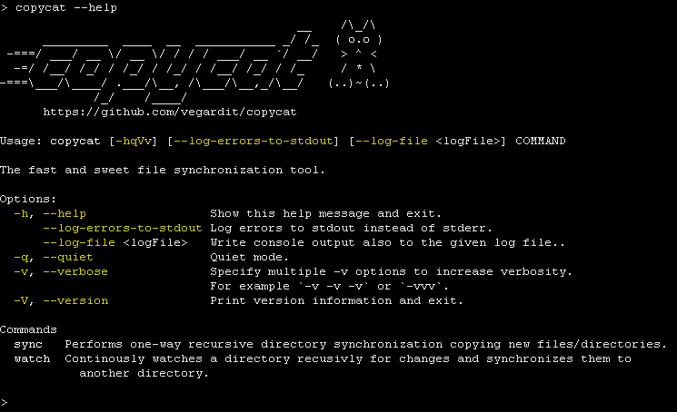

# copycat - the fast and sweet file synchronization tool

[](https://github.com/vegardit/copycat/actions?query=workflow%3A%22Build%22)
[](https://github.com/vegardit/copycat/releases/tag/snapshot)
[](LICENSE.txt)
[](CHANGELOG.md)
[](https://codeclimate.com/github/vegardit/copycat/maintainability)
[](CODE_OF_CONDUCT.md)

**IMPORTANT Copycat is currently in alpha testing and may not work as expected! DO NOT USE WITH IMPORTANT DATA!**

1. [What is it?](#what-is-it)
1. [Installation](#installation)
1. [Usage](#usage)
1. [License](#license)


## <a name="what-is-it"></a>What is it?

Copycat is a cross platform file synchronization tool for local file systems similar to [robocopy](https://docs.microsoft.com/en-us/windows-server/administration/windows-commands/robocopy) for Windows.

It's written in Java but compiled to native binaries for Windows/Linux/MacOS using [GraalVM](https://graalvm.org).




Advantages over robocopy:
- exclude files/folders using relative paths and glob patterns
- cross platform support
- ANSI colored console output
- tray-icon and desktop notifications about major sync events
- YAML config file

## <a name="installation"></a>Installation

For Windows/Linux/MacOS self-contained binaries can be downloaded at https://github.com/vegardit/copycat/releases

No installation is required.


## Usage <a name="usage"></a>Usage

Copycat understands two commands:
- `sync` is used to synchronize files from one directory to another
- `watch` is used to continuously watch a directory for changes and instantly syncs the changes to a given target

### sync command

```
$ copycat sync --help

Usage: copycat sync [-hqVv] [--copy-acl] [--delete] [--delete-excluded] [--dry-run] [--exclude-hidden-files]
                    [--exclude-hidden-system-files] [--exclude-older-files] [--exclude-system-files] [--ignore-errors]
                    [--ignore-symlink-errors] [--log-errors-to-stdout] [--config <path>] [--log-file <path>]
                    [--threads <count>] [--exclude <pattern>[,<pattern>...]]... [--no-log <op>[,<op>...]]... [SOURCE] [TARGET]

Performs one-way recursive directory synchronization copying new files/directories.

Positional parameters:
      [SOURCE]            Directory to copy from files.
      [TARGET]            Directory to copy files to.

Options:
      --config <path>     Path to a YAML config file.
      --copy-acl          Copy file permissions (ACL) for newly copied files.
      --delete            Delete extraneous files/directories from target.
      --delete-excluded   Delete excluded files/directories from target.
      --dry-run           Don't perform actual synchronization.
      --exclude <pattern>[,<pattern>...]
                          Glob pattern for files/directories to be excluded from sync.
      --exclude-hidden-files
                          Don't synchronize hidden files.
      --exclude-hidden-system-files
                          Don't synchronize hidden system files.
      --exclude-older-files
                          Don't override newer files in target with older files in source.
      --exclude-system-files
                          Don't synchronize system files.
  -h, --help              Show this help message and exit.
      --ignore-errors     Continue sync when errors occur.
      --ignore-symlink-errors
                          Continue if creation of symlinks on target fails.
      --log-errors-to-stdout
                          Log errors to stdout instead of stderr.
      --log-file <path>   Write console output also to the given log file..
      --no-log <op>[,<op>...]
                          Don't log the given sync operation. Valid values: CREATE, MODIFY, DELETE, SCAN
  -q, --quiet             Quiet mode.
      --threads <count>   Number of concurrent threads. Default: 2
  -v, --verbose           Specify multiple -v options to increase verbosity.
                          For example `-v -v -v` or `-vvv`.
```

Example:
```batch
$ copycat sync C:\myprojects X:\myprojects --delete --threads 4
```

Default values and/or multiple sync tasks can be configured using a YAML config file:
```yaml
# default values for sync tasks
defaults:
  copy-acl: false
  delete: true
  delete-excluded: true
  dry-run: false
  exclude:
    - "**/node_modules"
  exclude-older-files: false
  exclude-hidden-files: false
  exclude-system-files: true
  exclude-hidden-system-files: false
  ignore-errors: false
  ignore-symlink-errors: false
  threads: 2

# sync tasks
sync:
- source: C:\mydata
  target: \\myserver\mydata
- source: D:\myotherdata
  target: \\myserver\myotherdata
```


### watch command

```
$ copycat watch --help

Usage: copycat watch [-hqVv] [--copy-acl] [--delete-excluded] [--exclude-hidden-files] [--exclude-hidden-system-files]
                     [--exclude-system-files] [--log-errors-to-stdout] [--config <path>] [--log-file <path>]
                     [--exclude <pattern>[,<pattern>...]]... [--no-log <op>[,<op>...]]... [SOURCE] [TARGET]

Continuously watches a directory recursively for changes and synchronizes them to another directory.

Positional parameters:
      [SOURCE]            Directory to copy from files.
      [TARGET]            Directory to copy files to.

Options:
      --config <path>     Path to a YAML config file.
      --copy-acl          Copy file permissions (ACL) for newly copied files.
      --delete-excluded   Delete excluded files/directories from target.
      --exclude <pattern>[,<pattern>...]
                          Glob pattern for files/directories to be excluded from sync.
      --exclude-hidden-files
                          Don't synchronize hidden files.
      --exclude-hidden-system-files
                          Don't synchronize hidden system files.
      --exclude-system-files
                          Don't synchronize system files.
  -h, --help              Show this help message and exit.
      --log-errors-to-stdout
                          Log errors to stdout instead of stderr.
      --log-file <path>   Write console output also to the given log file..
      --no-log <op>[,<op>...]
                          Don't log the given filesystem operation. Valid values: CREATE, MODIFY, DELETE
  -q, --quiet             Quiet mode.
  -v, --verbose           Specify multiple -v options to increase verbosity.
                          For example `-v -v -v` or `-vvv`.
```

Example:
```batch
$ copycat watch C:\myprojects X:\myprojects
```


Default values and/or multiple sync tasks can be configured using a YAML config file:
```yaml
# default values for sync tasks
defaults:
  copy-acl: false
  delete-excluded: true
  exclude:
    - "**/node_modules"
  exclude-hidden-files: false
  exclude-system-files: true
  exclude-hidden-system-files: false

# sync tasks
sync:
- source: C:\mydata
  target: \\myserver\mydata
- source: D:\myotherdata
  target: \\myserver\myotherdata
```

## <a name="license"></a>License

All files are released under the [Apache License 2.0](LICENSE.txt).

Individual files contain the following tag instead of the full license text:
```
SPDX-License-Identifier: Apache-2.0
```

This enables machine processing of license information based on the SPDX License Identifiers that are available here: https://spdx.org/licenses/.
